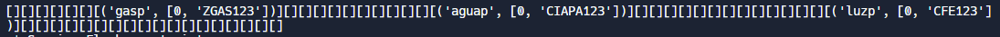

# Flask Sistema Cajero Automatico (ATM) 

## Description

Este proyecto implementa un sencillo sistema de cajero automatico. Este es el servidor (Flask) el cual crea un hashmap para almacenar la informacion enviada por el cliente.

## Ejemplo:
**Estructura Hashmap:**


## Codigo:
**Operaciones del Servidor:**
```python
@app.route('/withdraw')
def withdraw():
    username = request.args.get('accountid')
    amount = int(request.args.get('amount'))
    nip = request.args.get('nip')
    balance, regnip = hash_table.get_val(username)
    if (not checkNip(regnip, nip)):
        return '-:Nip incorrecto'
    if (balance - amount < 0):
        return '-:No hay fondos suficientes para retirar'
    balance -= amount
    hash_table.set_val(username, [balance, regnip])
    return f'+:El balance de {username} es {balance}'
```